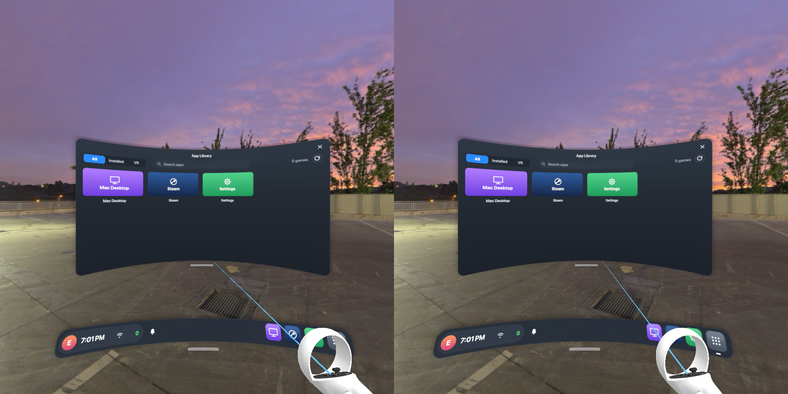
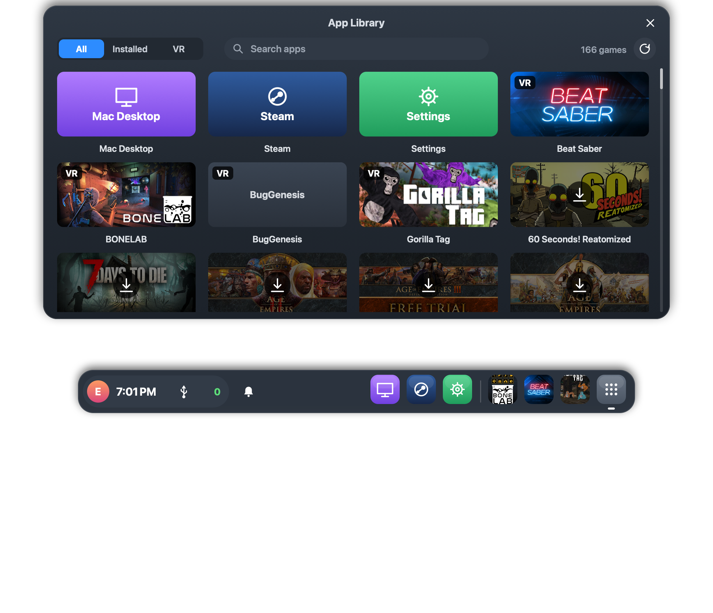
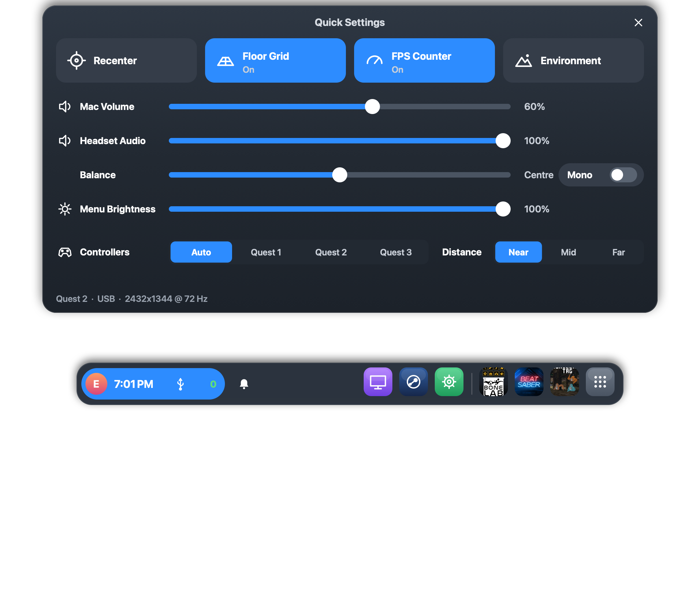
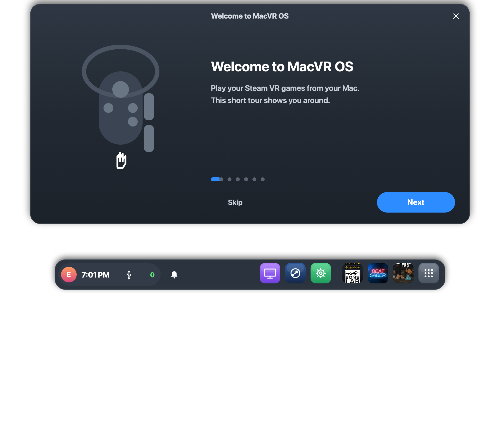
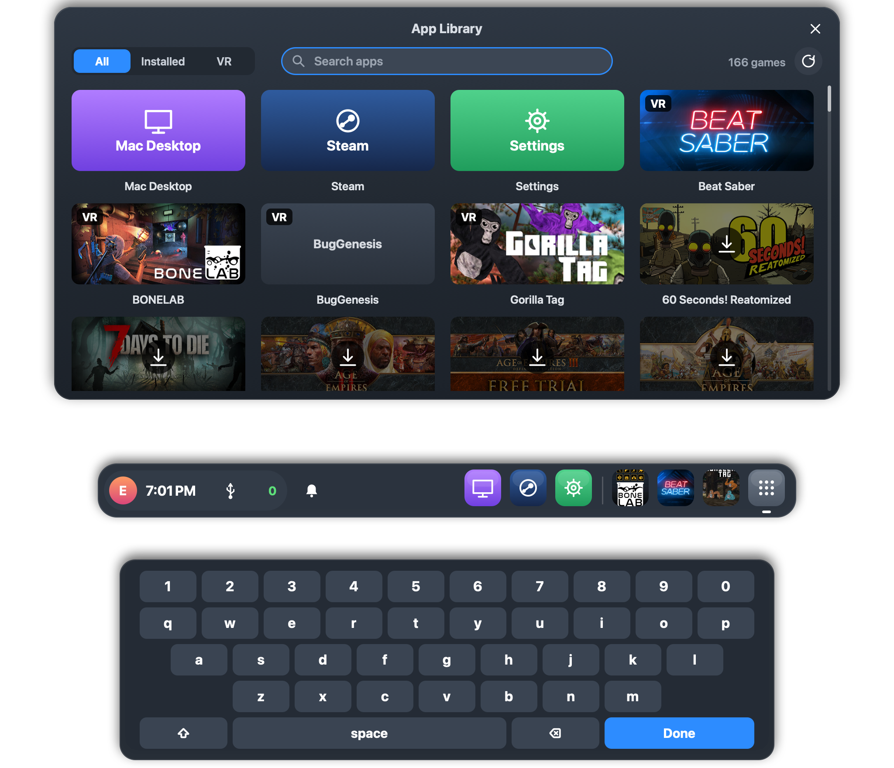
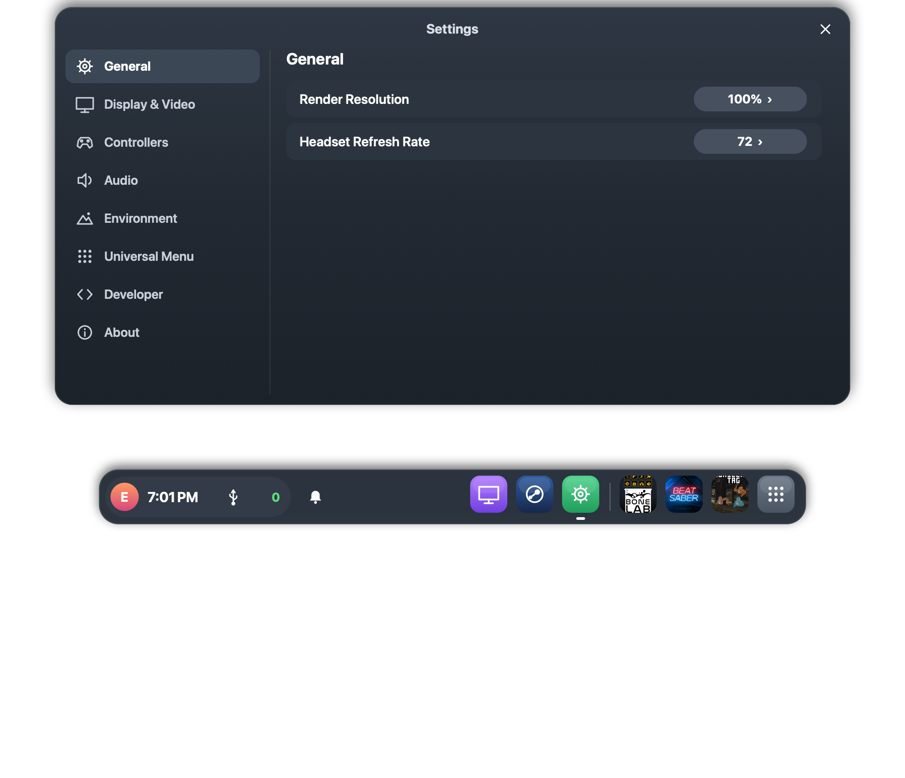

# MacVR OS — play Windows SteamVR games on a Mac with a Quest

MacVR streams Windows VR games running under Wine/Steam to a Meta Quest 1/2/3
(plus Steam Frame support in progress) over USB or Wi-Fi, and puts a Quest-style
Universal Menu over your game: dock, quick settings, desktop control, and a
pop-up keyboard.








> Screenshots are rendered from the real MacVR OS shell. Before publishing,
> re-render `app-library`/`keyboard` with a demo library if the real Steam
> library and dock avatar initial should stay private.

## What it is

```
mac/       MacVR.app: Universal Menu compositor, H.264/HEVC encoder, headset link,
           Steam-under-Wine setup (Sikarugir engine, OpenComposite, per-game fixes)
android/   Quest client APK (tracking + Touch input up, video/audio/haptics down)
runtime/   WineXR: the OpenXR runtime DLL games load inside Wine (separate repo)
common/    vr4mac.h: wire + shared-memory contract (canonical copy lives in WineXR)
release/   build-release.sh (DMG/zip + APK staging), export-repos.sh (publish split)
```

## Install (release)

1. Download `MacVR-<version>.dmg` and the Quest `VR4Mac.apk` from Releases.
2. Open the DMG, drag MacVR to Applications, and launch it.
3. The first launch sets everything up by itself: Wine engine (≈250 MB
   download), Steam bottle, the WineXR runtime, and OpenComposite — then shows
   an onboard tutorial (OOBE). Grant **Screen & System Audio Recording** and
   **Accessibility** when asked (desktop view/control needs them).
4. On the Quest, install the APK (`adb install VR4Mac.apk`), plug in USB
   (or join the same Wi-Fi), and pick your game in the library. VR-capable
   games already installed under Wine are detected automatically.

Wireless: same Wi-Fi, the headset finds the Mac by UDP broadcast. If your
network blocks broadcasts, enter the Mac address explicitly in the client.

## Build from source

Needs: Xcode command-line tools (Mac app), mingw-w64 (runtime DLL), JDK 21 +
Android SDK/NDK (APK).

```sh
runtime/build.sh              # WineXR DLL (mingw-w64)
mac/build.sh                  # MacVR.app (Xcode CLT only; bundles DLL + controller meshes)
open mac/build/VR4Mac.app
cd android && ./gradlew assembleDebug   # APK -> app/build/outputs/apk/debug/
```

Or build everything packaged: `./release/build-release.sh` (see `release/`).

Headless UI test (no headset needed): `mac/Tests/run.sh` — clicks every menu
control through its real effects. `ALL DASHBOARD INTERACTION TESTS PASSED`.

## Status / measured

- Gorilla Tag, Beat Saber and BONELAB verified playable in-headset (Quest 1, USB).
- H.264 2432×1344 side-by-side at 72 fps; headset decode ~52–68 fps after the
  encoder/preset fixes; pipeline counters in
  `~/Library/Application Support/VR4Mac/macvr.log`.
- HEVC 125% render scale is opt-in (Settings › Video): needs more bandwidth
  than the adb USB tunnel comfortably carries.
- Steam Frame support: tracked, hardware-unverified.

## Troubleshooting

- Desktop stays blank: allow VR4Mac under Screen & System Audio Recording.
- Desktop won't click: enable VR4Mac under Accessibility (Privacy & Security).
- Choppy game, smooth on Mac: lower the in-game preset / render scale; check
  `macvr.log` pipeline counters for encoder backlog.
- No audio: check the in-headset volume mixer and that the game outputs to the
  default device.

## License

MIT (see `LICENSE`). Third-party pieces (Sikarugir engine, OpenComposite,
Steam, controller meshes) keep their own licenses — see `THIRD_PARTY_NOTICES.md`.
