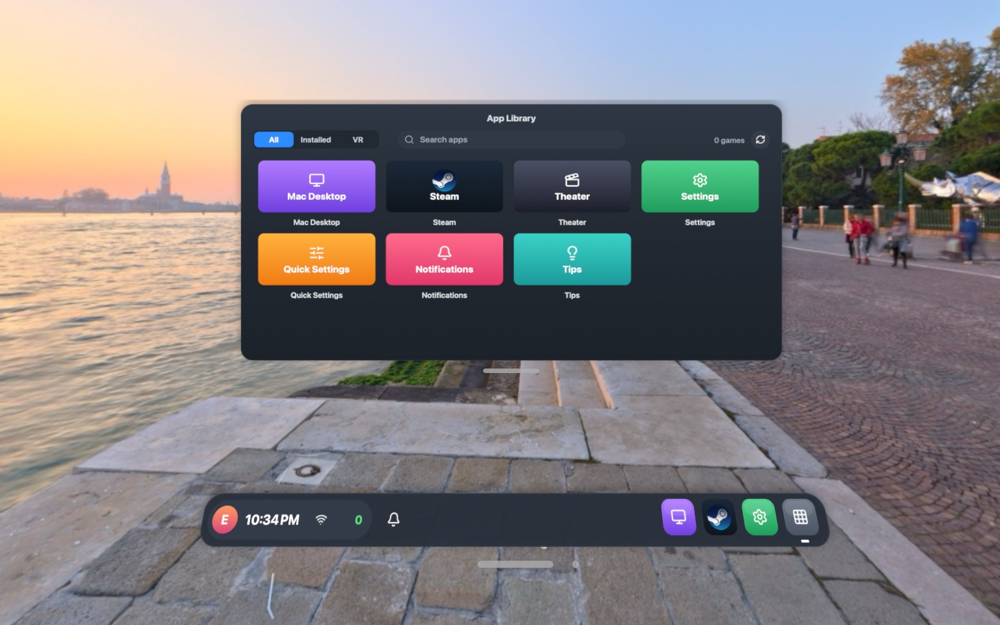
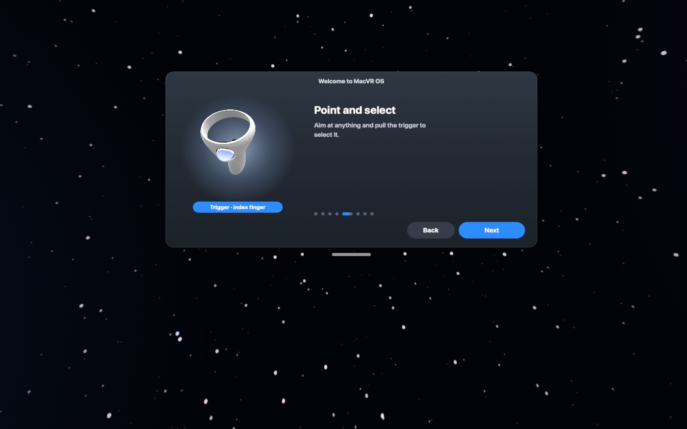
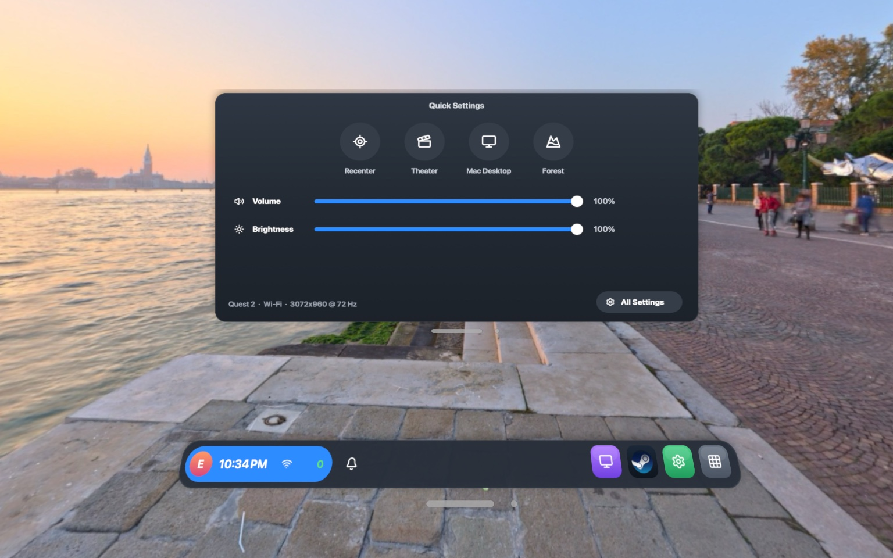
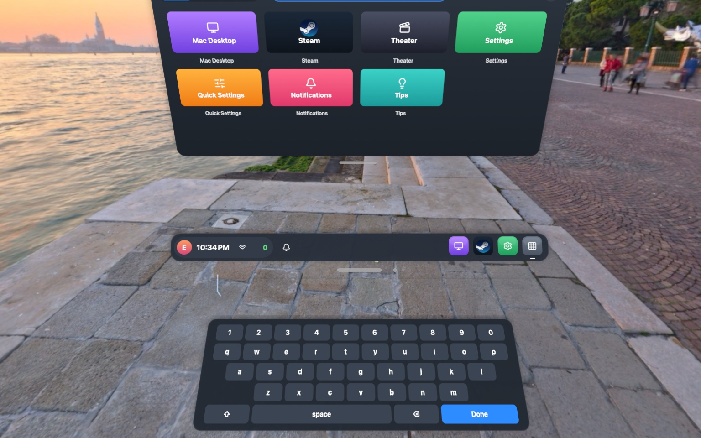
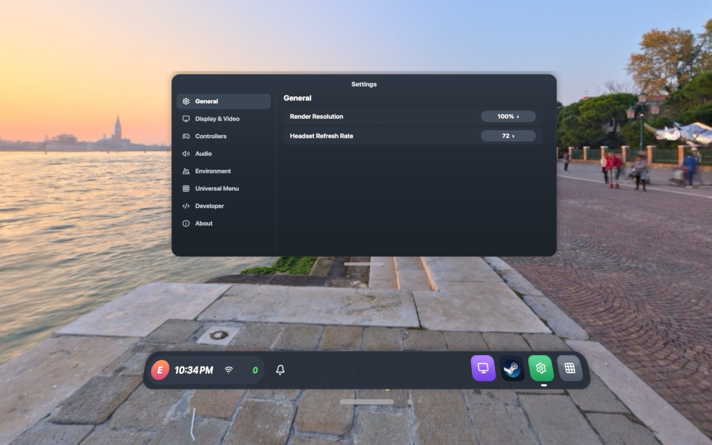

# MacVR OS — play Windows SteamVR games on a Mac with a Quest

MacVR streams Windows VR games running under Wine/Steam to a Meta Quest 1/2/3
(plus Steam Frame support in progress) over USB or Wi-Fi, and puts a Quest-style
Universal Menu over your game: dock, quick settings, desktop control, and a
pop-up keyboard.

<p align="center">
  
</p>

<table>
  <tr>
    <td width="50%"><br><strong>Learn the controls</strong> — guided setup with a live controller model.</td>
    <td width="50%"><br><strong>Quick Settings</strong> — shortcuts and adjustments within reach.</td>
  </tr>
  <tr>
    <td><br><strong>Pop-up keyboard</strong> — type, and move it by its own grab bar.</td>
    <td><br><strong>Settings</strong> — display, controllers, audio and environments.</td>
  </tr>
</table>

Screenshots are single-eye renders from the MacVR OS compositor.

## What it is

```
mac/       MacVR.app: Universal Menu compositor, H.264/HEVC encoder, headset link,
           Steam-under-Wine setup (Sikarugir engine, OpenComposite, per-game fixes)
android/   Quest client APK (tracking + Touch input up, video/audio/haptics down)
runtime/   WineXR: the OpenXR runtime DLL games load inside Wine (separate repo)
common/    vr4mac.h: wire + shared-memory contract (canonical copy lives in WineXR)
release/   build-release.sh (DMG/zip + APK staging), export-repos.sh (publish split)
```

## Install (release)

1. Download `MacVR-<version>.dmg` and `MacVR-Quest-<version>.apk` from Releases.
2. Open the DMG and drag MacVR to Applications. MacVR isn't notarized, so the first
   time macOS blocks it: open **System Settings > Privacy & Security** and click
   **Open Anyway** under the MacVR message.
3. The first launch sets everything up by itself:
   - It downloads the Wine engine (≈250 MB) and creates the Steam bottle.
   - It installs the WineXR runtime and OpenComposite.
   - It sets up SiliconXR (native Mac VR, including Vivecraft).
   - It offers to install the "MacVR Headset Mic" driver so games hear your headset's mic.
   Then it shows a short tutorial. Grant **Screen & System Audio Recording** and
   **Accessibility** when asked; desktop view and control need them.
4. On the Quest, install the APK (`adb install MacVR-Quest-<version>.apk`), plug in USB
   (or join the same Wi-Fi), and pick your game in the library. VR-capable
   games already installed under Wine are detected automatically.

Wireless: same Wi-Fi, the headset finds the Mac by UDP broadcast. If your
network blocks broadcasts, enter the Mac address explicitly in the client.

## Build from source

Needs: Xcode command-line tools (Mac app), mingw-w64 (runtime DLL), JDK 21 +
Android SDK/NDK (APK).

```sh
runtime/build.sh              # WineXR DLL (mingw-w64)
mac/build.sh                  # MacVR.app (Xcode CLT only; bundles DLL + controller meshes)
open mac/build/VR4Mac.app
cd android && ./gradlew assembleDebug   # APK -> app/build/outputs/apk/debug/
```

Or build everything packaged: `./release/build-release.sh` (see `release/`).

Headless UI test (no headset needed): `mac/Tests/run.sh` — clicks every menu
control through its real effects. `ALL DASHBOARD INTERACTION TESTS PASSED`.

## Status / measured

- Gorilla Tag, Beat Saber and BONELAB verified playable in-headset (Quest 1, USB).
- H.264 2432×1344 side-by-side at 72 fps; headset decode ~52–68 fps after the
  encoder/preset fixes; pipeline counters in
  `~/Library/Application Support/VR4Mac/macvr.log`.
- HEVC 125% render scale is opt-in (Settings › Video): needs more bandwidth
  than the adb USB tunnel comfortably carries.
- Steam Frame support: tracked, hardware-unverified.

## Troubleshooting

- Desktop stays blank: allow VR4Mac under Screen & System Audio Recording.
- Desktop won't click: enable VR4Mac under Accessibility (Privacy & Security).
- Choppy game, smooth on Mac: lower the in-game preset / render scale; check
  `macvr.log` pipeline counters for encoder backlog.
- No audio: check the in-headset volume mixer and that the game outputs to the
  default device.

## License

MIT (see `LICENSE`). Third-party pieces (Sikarugir engine, OpenComposite,
Steam, controller meshes) keep their own licenses — see `THIRD_PARTY_NOTICES.md`.
